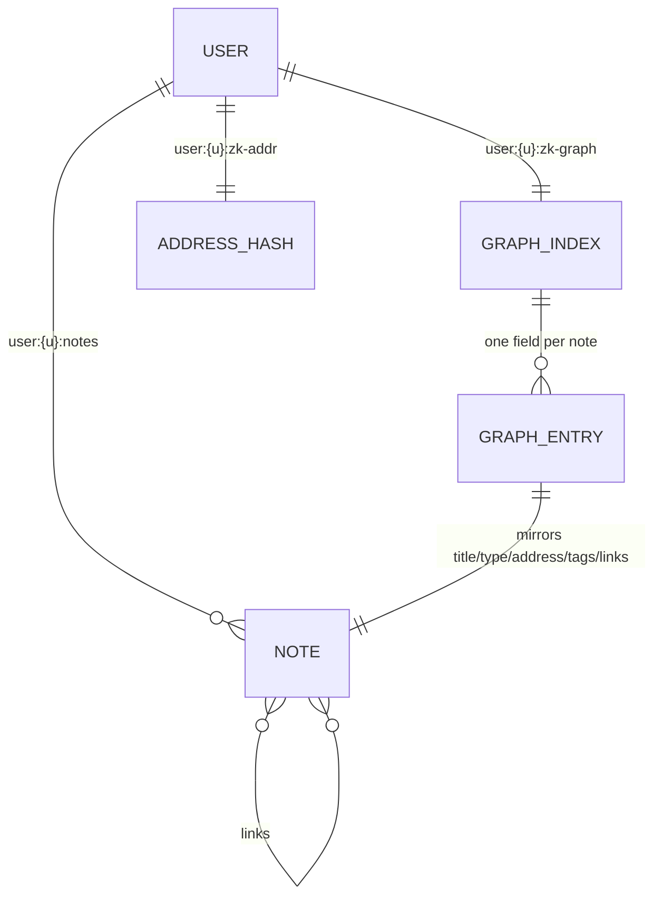
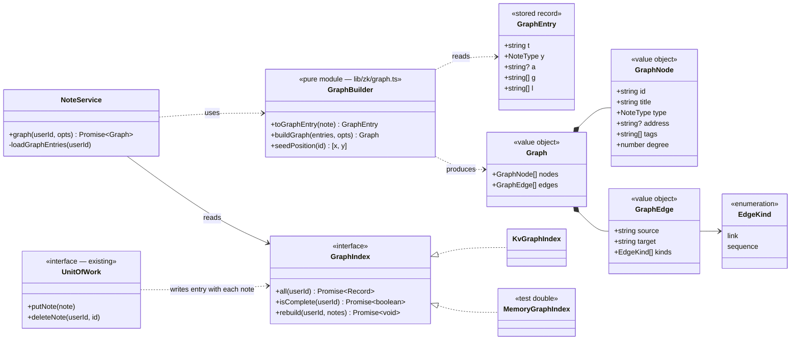
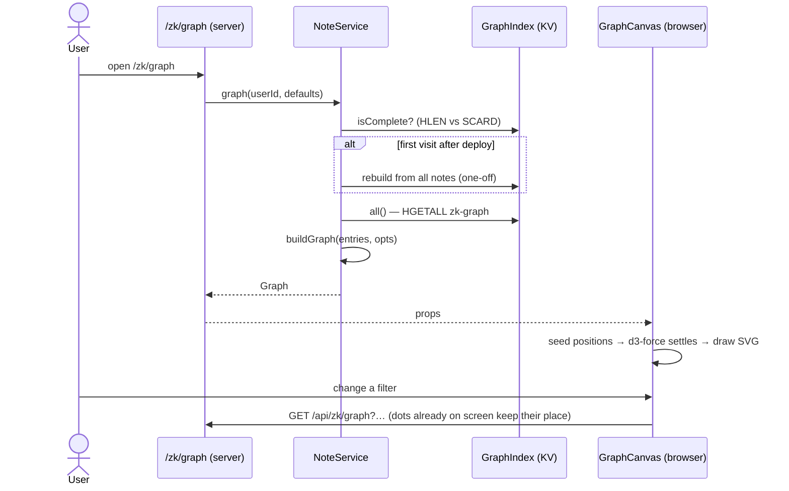
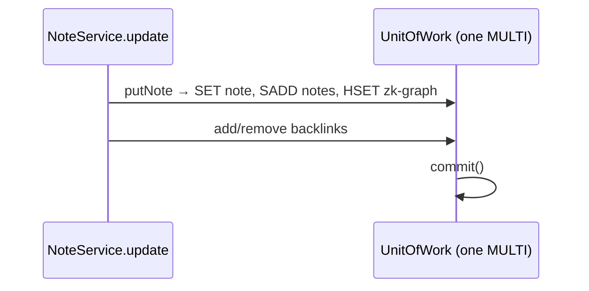

# Zettelkasten Graph View — Low-Level Design

Status: **Draft for review**
Builds on: `docs/zettelkasten-lld.md` (notes, links, backlinks, Folgezettel addresses).
Scope: **the whole-collection graph at `/zk/graph` only.** The per-note local graph is deferred.

---

## 0. In simple terms

Every note is a **dot**; every connection between two notes is a **line**. Building the graph has three steps:

1. **Keep a small index card per note.** Alongside each note we store a tiny summary: its title, type, address, tags, and which notes it links to. It never includes the note text. The card is updated automatically whenever the note is saved or deleted.
2. **Turn the cards into dots and lines.** When you open `/zk/graph`, the server reads all the cards in one go:
   - every card becomes a dot;
   - every `[[link]]` becomes a line;
   - every Folgezettel parent → child pair (`1` → `1a`) becomes a dashed line.
3. **Let physics arrange it.** In the browser:
   - lines act like springs, pulling connected notes together;
   - dots push each other apart;
   - after a second or so it settles, and notes about related ideas end up clustered.

   You can hover, click, drag and zoom.

---

## 1. Requirements

| # | Requirement |
|---|---|
| G1 | `/zk/graph` shows every note as a node and every connection as an edge. |
| G2 | Two edge kinds: **link** (`[[…]]` in a body) and **sequence** (Folgezettel parent → child). Sequence edges can be toggled. |
| G3 | Node size grows with the number of connections; node shape and tone show the note type. |
| G4 | Hover highlights a node and its neighbours; click opens the note; drag moves and pins; zoom and pan. |
| G5 | Filters: note types, sequence edges on/off, hide orphans, tag. A search box centres a chosen node. |
| G6 | Stable layout: the same notes give the same starting picture on every visit. |

Non-functional:
- Loading the graph must not read note bodies.
- Graph data is written in the same transaction as the note, so it is never out of date.
- Smooth up to ~1,500 nodes (SVG).

---

## 2. Database schema

### 2.1 The one new key

| Key | Redis type | Field | Value |
|---|---|---|---|
| `user:{u}:zk-graph` | hash | note id | `GraphEntry` as compact JSON |

```ts
export type GraphEntry = {
  t: string     // title
  y: NoteType   // type
  a?: string    // Folgezettel address
  g: string[]   // tags
  l: string[]   // outgoing link targets (= Note.links)
}
```

Example:
```
HGET user:abc:zk-graph qWxykXh38R
→ {"t":"Indexes","y":"fleeting","a":"2","g":["db"],"l":["Pk2mXa91Lq"]}
```

### 2.2 Why it's needed

Without it, the server would have to download every full note, including its text (up to 50 KB each), just to read titles and links. Each entry is about 100–200 bytes, so 5,000 notes ≈ 1 MB in one `HGETALL`.

The index is **derived**: it holds nothing that isn't also in `note:{u}:{id}`, so it can always be rebuilt (just like the backlink sets).

### 2.3 Full key layout after this change

| Key | Type | Holds | Status |
|---|---|---|---|
| `note:{u}:{id}` | string (JSON) | the full Note | source of truth |
| `note:{u}:{id}:backlinks` | set | ids linking to `{id}` | existing, derived |
| `user:{u}:notes` | set | all note ids | existing |
| `user:{u}:zk-addr` | hash | address → note id | existing |
| `user:{u}:zk-addr-next:{parent}` | integer | child counter | existing |
| **`user:{u}:zk-graph`** | **hash** | **note id → GraphEntry** | **new, derived** |
| `source:{u}:{id}`, `user:{u}:sources`, `source:{u}:{id}:notes` | | sources | existing |



### 2.4 Keeping it in sync

Every note change already goes through two `UnitOfWork` calls. Each gains one command inside the **same `MULTI`**:

| Call | Already does | Adds |
|---|---|---|
| `putNote(note)` | `SET note`, `SADD notes` | `HSET user:{u}:zk-graph {id} toGraphEntry(note)` |
| `deleteNote(u, id)` | `DEL note`, `DEL backlinks`, `SREM notes` | `HDEL user:{u}:zk-graph {id}` |

This covers create, edit, promote, continue-this-thought and the review bridge, with no change to `NoteService` write code.

### 2.5 Existing notes (backfill)

1. On each graph load, compare `HLEN zk-graph` with `SCARD notes` (two cheap calls, pipelined).
2. If they differ, rebuild once: load all notes, `DEL` the index, `HSET` every entry in one `MULTI`.
3. After that, the counts match and no rebuild happens.

This needs no migration script.

---

## 3. Object model (OOP)



| Class | Responsibility |
|---|---|
| `GraphEntry` | What is stored per note in the index. |
| `GraphNode`, `GraphEdge`, `Graph` | What the API returns and the browser draws. |
| `GraphBuilder` | Pure functions, with no database access, so they are easy to test. |
| `GraphIndex` | The storage seam (same pattern as `NoteRepository`): KV in production, in-memory in tests. |
| `NoteService.graph()` | The only new service method: makes sure the index is complete, reads it, builds the graph. |

Edges are **undirected** on screen, so one line is drawn per pair of notes. "Continue this thought" creates both a sequence edge and a "Continues [[parent]]" link between the same two notes; they merge into one line with `kinds: ['link','sequence']`.

---

## 4. Algorithm — `buildGraph(entries, opts)`

```
keep = entry ids that pass the type / tag filters
byAddress = address → id   (for entries with an address)

edges = map keyed by the pair "smallerId|largerId" → set of kinds
for each id in keep:
  for each target in entries[id].l:
      if target in keep and target ≠ id → add 'link' to pair(id, target)
  if opts.sequence and entries[id].a:
      parent = parentAddress(entries[id].a)          // "1a" → "1"
      if byAddress[parent] in keep → add 'sequence' to pair(byAddress[parent], id)

degree[id] = number of edges touching id
if opts.hideOrphans → remove nodes with degree 0
```

- Runs in O(notes + links).
- Links to notes deleted later are skipped by the `in keep` check.

`seedPosition(id)` hashes the id into a fixed point on a circle. Every node starts from the same place on each visit, so the picture is stable without storing positions anywhere.

---

## 5. API

| Method | Path | Query | Returns |
|---|---|---|---|
| GET | `/api/zk/graph` | `sequence=0\|1` (default 1) · `types=permanent,structure` · `tag=x` · `orphans=0\|1` | `Graph` |

- Needs a session (401 otherwise) and is scoped to `session.userId`.
- The page renders the first graph on the server; the API is called only when filters change.

---

## 6. Flows

### 6.1 Opening `/zk/graph`


### 6.2 Saving a note


---

## 7. UI

```
┌──────────────────────────────────────────────────────────────┐
│ ← Notes        Graph                      42 notes · 57 lines │
├──────────────────────────────────────────────────────────────┤
│ [search…]  ☑ fleeting ☑ literature ☑ permanent ☑ structure   │
│ ☑ sequence lines   ☐ hide orphans   #tag ▾                    │
├──────────────────────────────────────────────────────────────┤
│        ●───●            ◆                                     │
│       /     \          /                                      │
│  ○───●       ●───◆───●        ●                               │
│                   ┊                                           │
│                   ●                                           │
├──────────────────────────────────────────────────────────────┤
│ ● permanent ◆ structure ▪ literature ○ fleeting │ — link ┊ sequence │
└──────────────────────────────────────────────────────────────┘
```
- Reached from a "Graph" link on the Notes home page.
- **Note type uses shape and ink tone, not colour** (the app's design rule):
  - ● permanent
  - ◆ structure
  - ▪ literature
  - ○ fleeting
- **Size:** the radius is `4 + 2·√connections`.
- **Lines:** solid for links, dashed for sequence.
- **Hover:** the note and its neighbours stay sharp; everything else fades.
- **Labels:** shown on hover and once zoomed in.
- **Pointer:** click opens the note, drag pins it, double-click unpins it.

**Components:**
- `GraphView` handles filters, search, legend and refetching.
- `GraphCanvas` is the only code where d3 touches the page. It uses `d3-force` (springs and repulsion), `d3-zoom`, `d3-drag` and `d3-selection`, about 30 KB.

---

## 8. Files
```
lib/zk/graph.ts                  GraphBuilder (pure)
lib/zk/graph.test.ts
lib/zk/types.ts                  + GraphEntry, GraphNode, GraphEdge, Graph, GraphOptions
lib/zk/repo.ts                   + GraphIndex interface, in-memory impl, ZkStore.graph
lib/zk/kv-repo.ts                + KvGraphIndex; putNote/deleteNote also write zk-graph
lib/zk/service.ts                + graph()
app/api/zk/graph/route.ts
app/zk/graph/page.tsx
components/zk/graph/GraphView.tsx
components/zk/graph/GraphCanvas.tsx
```

## 9. Tests
- **`buildGraph`:**
  - link and sequence edges, and merging them;
  - stale targets and self-links skipped;
  - type, tag and orphan filters;
  - degree counts.
- **`seedPosition`:** same id gives the same point.
- **Index consistency:** after create / edit / promote / continue / delete / review-bridge, the index equals `toGraphEntry` of every note. Deleting the index and loading the graph rebuilds it.
- **Browser check:**
  - the graph renders;
  - hover highlights;
  - click navigates;
  - filters refetch;
  - no horizontal scroll at 390 px.

## 10. Deferred
- Local graph on each note page.
- `<canvas>` rendering for collections larger than ~1,500 notes.
