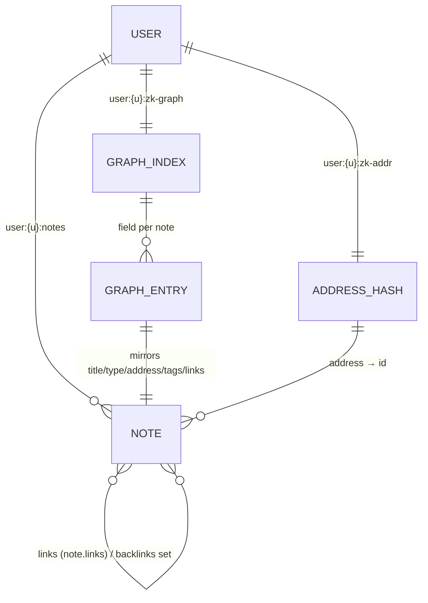
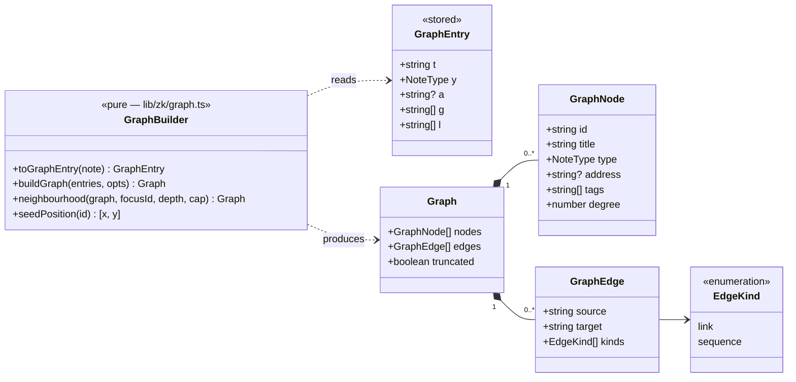
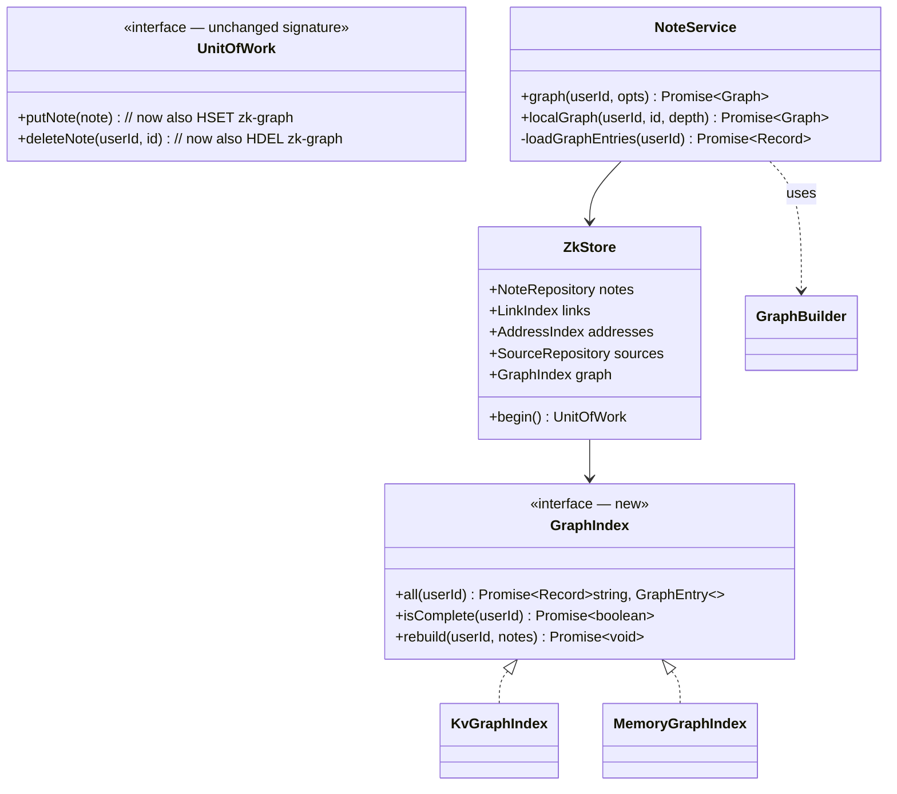
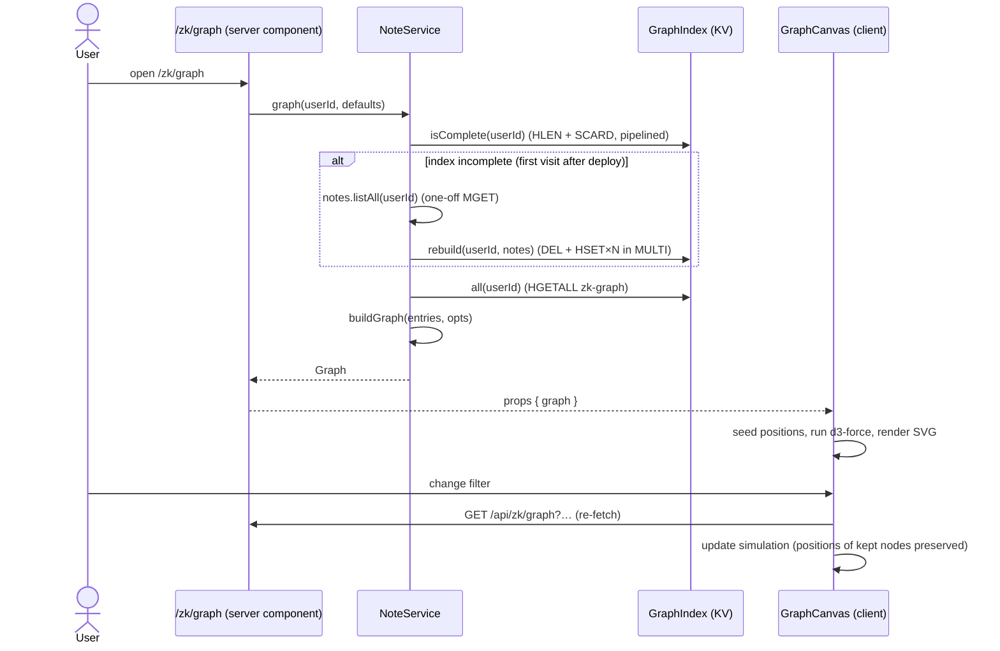
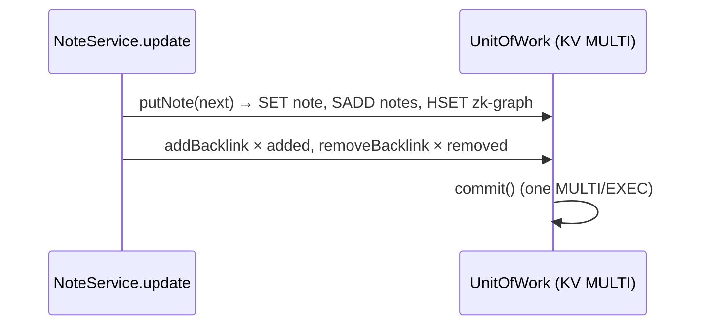
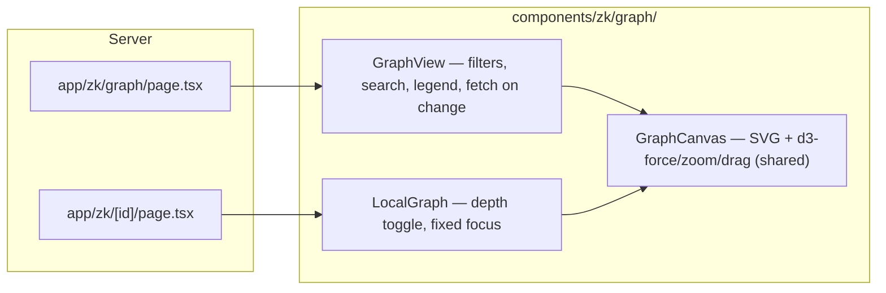

# Zettelkasten Graph View — Low-Level Design

Status: **Draft for review**
Builds on: `docs/zettelkasten-lld.md` (notes, links, backlinks, Folgezettel addresses).
Scope: (1) a whole-collection graph at `/zk/graph`; (2) a local graph on each note page.

---

## 1. Requirements

### Functional
| # | Requirement |
|---|---|
| G1 | `/zk/graph` shows every note as a node and every connection as an edge. |
| G2 | Two edge kinds: **link** (a `[[…]]` in a note body) and **sequence** (Folgezettel parent → child, e.g. `1a` → `1a1`). Sequence edges can be toggled off. |
| G3 | Node size reflects how connected the note is; node style reflects note type. |
| G4 | Hover a node: highlight it and its neighbours, show the title. Click: open the note. Drag: move it (and pin it). Zoom and pan. |
| G5 | Filters: note types, hide orphans, tag, and a search box that finds and centres a node. |
| G6 | Each note page shows a **local graph**: the note plus notes 1 or 2 hops away (toggle), with the current note centred. |
| G7 | Layout is stable between visits: the same collection gives the same starting picture. |

### Non-functional
- Loading the graph must **not** read every note body. Today's home page loads all bodies, which is fine for summaries but too heavy for a graph of thousands of notes.
- Graph data stays consistent with notes: it is written in the same `MULTI` as the note itself.
- Target: smooth interaction up to ~1,500 nodes with SVG. Beyond that, see §11.

---

## 2. What exists today (and why it isn't enough)

Everything the graph needs is already stored, but spread out:

| Needed for the graph | Where it lives today | Cost to read for N notes |
|---|---|---|
| Node list | `user:{u}:notes` (set) | 1 × `SMEMBERS` |
| Title, type, tags, outgoing links | inside `note:{u}:{id}` JSON, **next to the full body** | 1 × `MGET` of N full notes, bodies included |
| Folgezettel edges | `user:{u}:zk-addr` (hash address → id) | 1 × `HGETALL` |

Building the graph from these would mean downloading every note body (up to 50 KB each) just to read titles and links. Hence the one schema addition below.

---

## 3. Database schema

### 3.1 New key: the graph index

| Key | Type | Field | Value |
|---|---|---|---|
| `user:{u}:zk-graph` | **hash** | note id | compact JSON `GraphEntry` (below) |

```ts
// lib/zk/types.ts
export type GraphEntry = {
  t: string     // title
  y: NoteType   // type
  a?: string    // Folgezettel address
  g: string[]   // tags
  l: string[]   // outgoing link targets (same as Note.links)
}
```

- Short field names keep each entry around 100–200 bytes. 5,000 notes ≈ 1 MB in a single `HGETALL`, versus tens of MB with bodies.
- This is a **derived index**, like the backlink sets: it never holds information that isn't also in `note:{u}:{id}`. If it is lost, it can be rebuilt from the notes.

### 3.2 Full key layout after this change

```
note:{u}:{id}                   Note JSON (source of truth)
note:{u}:{id}:backlinks         set   ids linking TO {id}             (existing, derived)
user:{u}:notes                  set   all note ids                    (existing)
user:{u}:zk-addr                hash  address → note id               (existing)
user:{u}:zk-addr-next:{parent}  int   child counter per parent        (existing)
user:{u}:zk-graph               hash  note id → GraphEntry JSON       (NEW, derived)
source:{u}:{id}                 Source JSON                            (existing)
user:{u}:sources                set   all source ids                  (existing)
source:{u}:{id}:notes           set   literature notes citing it      (existing)
```



### 3.3 Write rules (keeping the index consistent)

The index is written by the **same `UnitOfWork` calls** that already write notes. No service code changes, and no new failure modes:

| UnitOfWork call | Existing writes | Added write (same `MULTI`) |
|---|---|---|
| `putNote(note)` | `SET note:{u}:{id}`, `SADD user:{u}:notes` | `HSET user:{u}:zk-graph {id} toGraphEntry(note)` |
| `deleteNote(u, id)` | `DEL note…, note…:backlinks`, `SREM user:{u}:notes` | `HDEL user:{u}:zk-graph {id}` |

Every path that changes a note (create, update, promote, continue-this-thought assigning the parent an address, review bridge setting `reviewItemId`) goes through `putNote`, so all of them are covered automatically.

### 3.4 Backfill and self-healing

Notes created before this change (your current 5) have no index entry.

- On every graph read, the service compares `HLEN user:{u}:zk-graph` with `SCARD user:{u}:notes` (two cheap calls, pipelined).
- If they differ, it rebuilds:
  1. `MGET` all notes;
  2. `DEL` the index;
  3. `HSET` every entry in one `MULTI`.
- This runs once per user after deploy, and again only if the index ever drifts.
- No migration script and no downtime.

**Why not rebuild on every read?** Because a rebuild costs the full `MGET` with bodies, which is the expensive thing the index exists to avoid.

---

## 4. Domain model



```ts
// lib/zk/types.ts
export type EdgeKind = 'link' | 'sequence'

export type GraphNode = {
  id: string
  title: string
  type: NoteType
  address?: string
  tags: string[]
  degree: number          // distinct neighbours, any edge kind
}

export type GraphEdge = {
  source: string          // smaller id of the pair (edges are undirected on screen)
  target: string
  kinds: EdgeKind[]       // ['link'], ['sequence'] or both
}

export type Graph = {
  nodes: GraphNode[]
  edges: GraphEdge[]
  truncated: boolean      // local graph hit its node cap
}

export type GraphOptions = {
  sequence?: boolean      // include Folgezettel edges (default true)
  types?: NoteType[]      // only these note types (default all)
  tag?: string
  hideOrphans?: boolean
}
```

**Why undirected edges?**
- Each note page already lists *Links to* and *Linked from*; the graph is for seeing clusters, and arrowheads add clutter.
- "Continue this thought" creates both a sequence edge (parent → child) and a link (child → parent, from "Continues [[parent]]"). Merging by the unordered pair draws one line with `kinds: ['link', 'sequence']` instead of two lines on top of each other.

---

## 5. Repository and service changes



```ts
// lib/zk/service.ts (additions)
async function loadGraphEntries(userId: string) {
  if (!(await store.graph.isComplete(userId))) {
    await store.graph.rebuild(userId, await notes.listAll(userId))
  }
  return store.graph.all(userId)
}

graph(userId, opts)            → buildGraph(await loadGraphEntries(userId), opts)
localGraph(userId, id, depth)  → requireNote(id); neighbourhood(buildGraph(entries, { sequence: true }), id, depth, 60)
```

---

## 6. Algorithms (`lib/zk/graph.ts`, all pure and unit-tested)

### 6.1 `toGraphEntry(note)`
Copies `title, type, address, tags, links` into the short field names.

### 6.2 `buildGraph(entries, opts)`
```
ids     = keys(entries) filtered by opts.types / opts.tag
byAddr  = { entry.a → id  for entries with an address }

pairs = Map<"min|max", Set<EdgeKind>>
for id in ids:
  for t in entries[id].l:                       // link edges
    if t in ids and t != id: pairs[key(id,t)].add('link')
  if opts.sequence and entries[id].a:           // sequence edges
    p = parentAddress(entries[id].a)
    if p and byAddr[p] in ids: pairs[key(byAddr[p], id)].add('sequence')

degree[id] = number of pairs touching id
if opts.hideOrphans: drop nodes with degree 0
return { nodes, edges: pairs → GraphEdge[], truncated: false }
```
- Stale link targets (a note deleted after it was linked) are dropped by the `t in ids` check.
- Cost: O(N + E).

### 6.3 `neighbourhood(graph, focus, depth, cap = 60)`
```
adjacency from edges (undirected)
BFS from focus up to `depth` hops, recording visit order
keep the first `cap` visited nodes (focus first, then all 1-hop nodes, then 2-hop)
edges = graph edges whose both ends are kept
truncated = visited > cap
```
Because of BFS order, 1-hop neighbours are always kept before any 2-hop ones.

### 6.4 `seedPosition(id)` — stable layout (G7)
- A tiny string hash of the id becomes an angle and a radius, so each node always starts in the same place.
- The force simulation then settles from there.
- The same collection therefore gives the same picture every visit, with no positions stored in the database.

---

## 7. API

| Method | Path | Query | Returns |
|---|---|---|---|
| GET | `/api/zk/graph` | `sequence=0\|1` · `types=permanent,structure` · `tag=x` · `orphans=0\|1` | `Graph` |
| GET | `/api/zk/notes/[id]/graph` | `depth=1\|2` (default 1) | `Graph` (local, `truncated` set if capped) |

- Both need a session (401 otherwise) and are scoped to `session.userId`.
- An unknown note id returns 404 via `NotFoundError`.
- The pages render their first graph on the server (passing `Graph` as props). The API is used when filters or depth change.

---

## 8. Sequence diagrams

### 8.1 Open `/zk/graph`


### 8.2 Saving a note keeps the graph current


### 8.3 Local graph on a note page
```mermaid
sequenceDiagram
  participant P as /zk/[id] (server)
  participant S as NoteService
  participant L as LocalGraph (client)
  P->>S: getView(id) and localGraph(id, depth=1)  (parallel)
  S->>S: loadGraphEntries → buildGraph → neighbourhood(id, 1, 60)
  P-->>L: props { graph, focusId }
  L->>L: focus node fixed at centre; others settle around it
  L->>P: depth toggle 2 → GET /api/zk/notes/[id]/graph?depth=2
```

---

## 9. UI design

### 9.1 `/zk/graph` (whole collection)
```
┌────────────────────────────────────────────────────────────┐
│ Graph                                    42 notes · 57 edges │
├────────────────────────────────────────────────────────────┤
│ [search…]   ☑ fleeting ☑ literature ☑ permanent ☑ structure │
│ ☑ sequence edges   ☐ hide orphans   #tag ▾        [reset]   │
├────────────────────────────────────────────────────────────┤
│                                                              │
│         ●───●            ◆                                   │
│        /     \          /                                    │
│   ○───●       ●───◆───●        ●                             │
│                    ┊                                         │
│                    ●   (dashed = sequence)                   │
│                                                              │
├────────────────────────────────────────────────────────────┤
│ ● permanent  ○ fleeting  ◆ structure  ▪ literature   — link ┊ sequence │
└────────────────────────────────────────────────────────────┘
```
- Reached from a "Graph" link in the `/zk` header. It isn't a separate Nav entry.
- **Nodes:**
  - shape and tone show the note type (see §9.3);
  - radius is `4 + 2·√degree`;
  - labels show for hovered and focused nodes, and for all nodes once zoomed in past 1.5×.
- **Edges:** a solid hairline for links and a dashed hairline for sequence. An edge that is both is drawn solid.
- **Hover:** the node and its neighbours stay full strength; everything else fades to 15%.
- **Click** opens `/zk/{id}`. **Drag** pins the node; double-click unpins it.
- **Search:** picking a result centres and highlights that node, reusing `useNoteSearch` over the node titles.
- **Empty state:** "No connections yet — link notes with [[ in the editor."

### 9.2 Local graph on the note page
- It sits between the body and the *Links to / Linked from* lists, about 280 px tall and full column width.
- The current note is fixed at the centre and drawn larger.
- A "1 hop · 2 hops" toggle switches depth, and "Open full graph →" opens `/zk/graph?focus={id}` with that note centred.
- It is hidden when the note has no connections, so it doesn't show a single lonely dot.

### 9.3 Visual encoding

The app's design rule is "no accent colour; emphasis is weight and darkness". So note type is shown with **shape plus ink tone**, not hue:

| Type | Mark |
|---|---|
| permanent | filled circle, `--ink` |
| structure | filled diamond, `--ink`, larger minimum size |
| literature | filled square, `--ink-2` |
| fleeting | hollow circle, `--ink-3` stroke |

These are re-checked against the dataviz guidelines during the build, so the marks stay readable on the paper background.

---

## 10. Rendering and components



- **`GraphCanvas`** is the one place d3 touches the DOM, inside `useEffect`. React owns the container; d3 owns the `<g>` it creates. Props are `{ graph, focusId?, highlight?, height }`.
  - **Forces:** `forceLink` (distance 40; sequence edges 30 and stronger), `forceManyBody` (−80), `forceCollide` (radius + 2) and `forceCenter`.
  - **Rerender:** when `graph` changes, nodes that already exist keep their x/y (looked up by id), and the simulation reheats gently (alpha 0.3) instead of restarting.
  - **Cleanup:** unmounting stops the simulation and removes listeners.
- **Dependencies:** `d3-force`, `d3-zoom`, `d3-drag`, `d3-selection` (plus `@types/*` in dev), about 30 KB gzipped. These are the d3 modules only, not the whole library.

---

## 11. Performance and limits

| Notes | Plan |
|---|---|
| ≤ 1,500 | SVG as designed. |
| 1,500 – 5,000 | Same data; switch `GraphCanvas` to draw on `<canvas>` (same simulation code, different draw function). Not built now; the component boundary allows it. |
| > 5,000 | Server-side filtering by type and tag becomes the default; the full graph is opt-in. |

Server cost per graph load: `HLEN` + `SCARD` (pipelined) + `HGETALL`, then O(N + E) in memory. No note bodies are read.

---

## 12. File layout
```
lib/zk/graph.ts                     toGraphEntry, buildGraph, neighbourhood, seedPosition (pure)
lib/zk/graph.test.ts
lib/zk/types.ts                     + GraphEntry, GraphNode, GraphEdge, Graph, GraphOptions
lib/zk/repo.ts                      + GraphIndex interface, memory impl, ZkStore.graph
lib/zk/kv-repo.ts                   + KvGraphIndex; putNote/deleteNote also write zk-graph
lib/zk/service.ts                   + graph(), localGraph()
app/api/zk/graph/route.ts
app/api/zk/notes/[id]/graph/route.ts
app/zk/graph/page.tsx
app/zk/[id]/page.tsx                + localGraph in the parallel load
components/zk/graph/GraphCanvas.tsx
components/zk/graph/GraphView.tsx
components/zk/graph/LocalGraph.tsx
```

## 13. Testing
| What | Tests |
|---|---|
| `buildGraph` | link edges; sequence edges from addresses; merging of link + sequence on the same pair; stale targets dropped; self-links ignored; type, tag and orphan filters; degree counts |
| `neighbourhood` | depth 1 vs 2; cap keeps all 1-hop nodes before any 2-hop; `truncated` flag; unknown focus |
| `seedPosition` | same id gives the same point; ids spread around the circle |
| Index consistency (memory store) | after create / update / promote / continue / delete / review-bridge, `graph.all()` equals `toGraphEntry` of every note; rebuild after deleting the index restores it |
| UI | headless browser: graph renders, hover highlights, click navigates, filter refetches, local graph depth toggle, 390 px layout |

## 14. Open questions
1. **PR placement:** a new PR (`feature/zettelkasten-graph`) stacked on PR #5, or added to PR #5?
2. **Sequence edges** on by default (current design), or off by default?
3. **Type encoding:** shape plus ink tone (current design, matches the no-colour style), or allow one muted colour per type?
