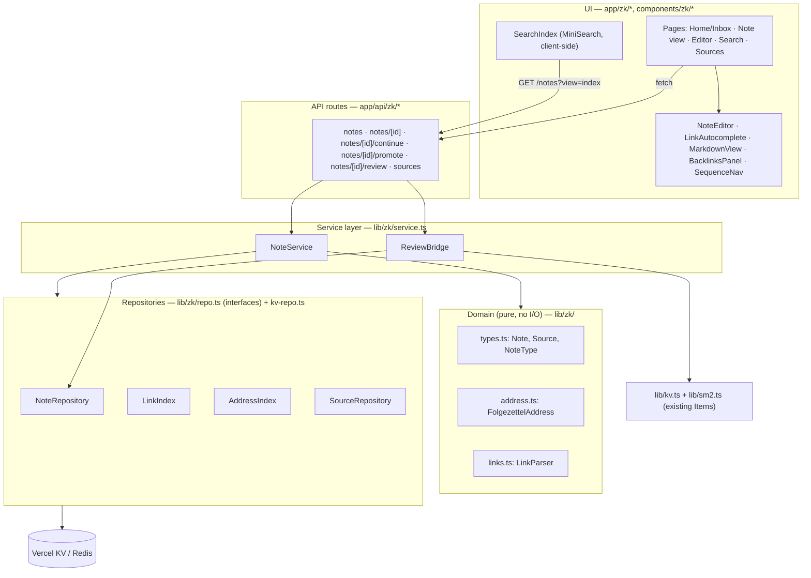
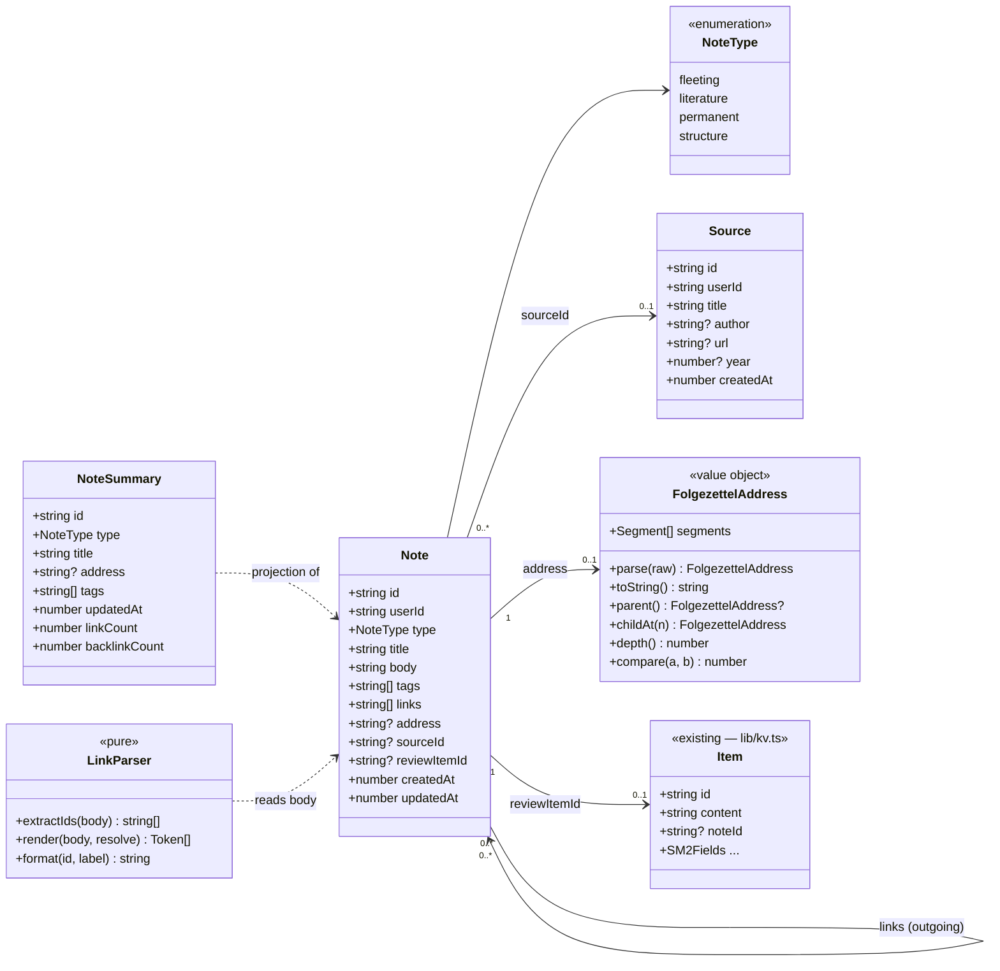
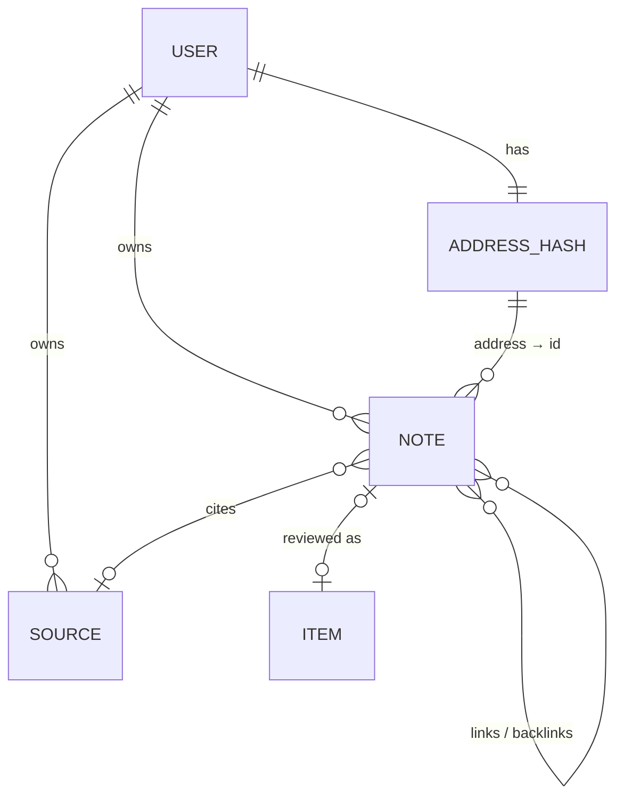
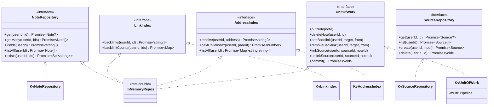
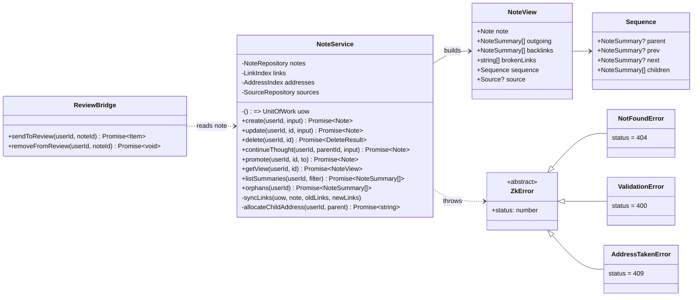
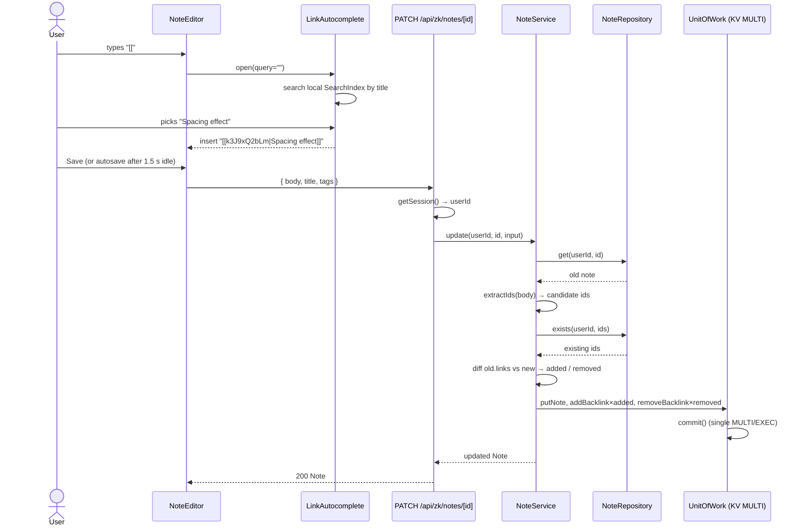
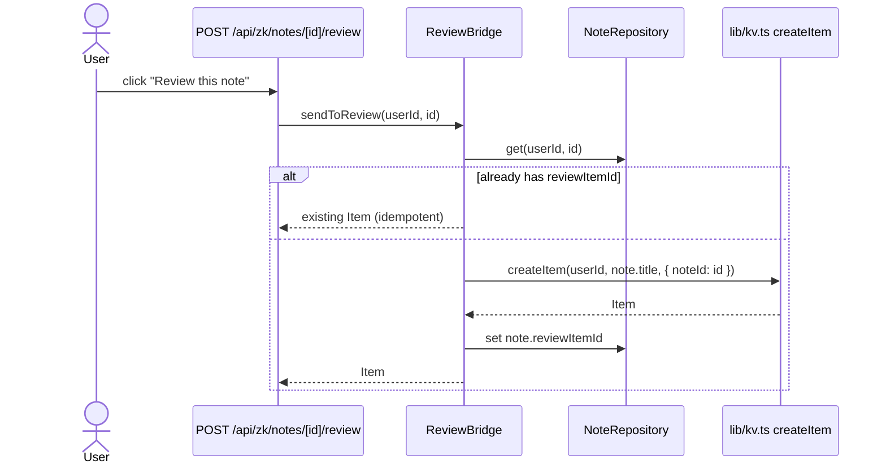
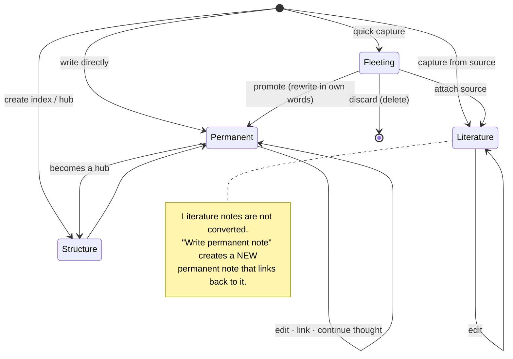
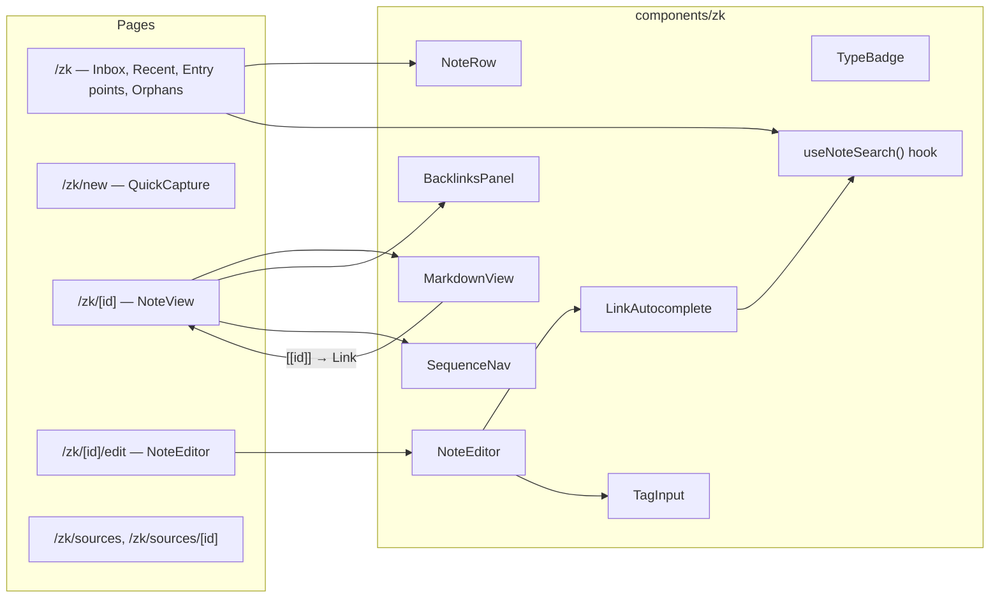

# Zettelkasten — Low-Level Design

Status: **Implemented** (see §16 for where the code differs from the first draft)
Scope: a `/zk` section inside MindGym (this app), reusing its auth (`lib/auth.ts`), storage (Vercel KV) and SM-2 review (`lib/sm2.ts`).

---

## 1. Requirements

### Functional
| # | Requirement |
|---|---|
| F1 | Create, read, update, delete notes (markdown body, title, tags). |
| F2 | Notes have a type: `fleeting`, `literature`, `permanent`, `structure`. |
| F3 | Notes link to each other with `[[id\|label]]`; every note shows its **backlinks**. |
| F4 | Optional Folgezettel address (`1`, `1a`, `1a1`, `1b` …). "Continue this thought" gives a new note the next free child address. |
| F5 | Literature notes reference a `Source` (book, article, URL). |
| F6 | Inbox of unprocessed fleeting notes; promote fleeting → permanent. |
| F7 | Full-text + tag search. |
| F8 | Send a note to the SM-2 review queue. |
| F9 | Flag orphans (permanent notes with no links in or out). |

### Non-functional
- Single user per collection; up to ~5,000 notes per user without redesign.
- Links must never silently break: IDs are immutable, renaming a title changes nothing.
- Writes that touch several keys (note + backlinks) are applied in one `MULTI` transaction.
- Same conventions as existing code: `getSession()` in every route, data keyed by `userId`.

---

## 2. Architecture (layers)



**Rules**
- The domain layer is pure functions and value types, so it can be unit-tested without KV.
- Only the repository layer touches KV. Services depend on repository **interfaces**, so tests can use an in-memory implementation.
- API routes stay thin: auth → validate input → call service → JSON. This is the same shape as `app/api/items/route.ts`.

> **OOP vs. this codebase.** The current code is functional modules (`lib/kv.ts`). The diagrams below use classes and interfaces because they show responsibilities clearly. In code, repositories are plain objects that implement a TS interface, and services are functions that take those repos. That gives the OOP benefits (swappable implementations, testable seams) without classes that don't match the rest of the app.

---

## 3. Domain model

### 3.1 Class diagram



### 3.2 Types (`lib/zk/types.ts`)

```ts
export type NoteType = 'fleeting' | 'literature' | 'permanent' | 'structure'

export type Note = {
  id: string            // nanoid(10), immutable — the only thing links point at
  userId: string
  type: NoteType
  title: string
  body: string          // markdown; links are [[id]] or [[id|label]]
  tags: string[]        // lower-cased, deduped
  links: string[]       // DERIVED on save from body; existing, non-self targets only
  address?: string      // Folgezettel, e.g. "3a2"; unique per user
  sourceId?: string     // required when type === 'literature'
  reviewItemId?: string // set when sent to SM-2
  createdAt: number
  updatedAt: number
}

export type NoteSummary = Pick<Note, 'id' | 'type' | 'title' | 'address' | 'tags' | 'updatedAt'> & {
  linkCount: number
  backlinkCount: number
}

export type Source = {
  id: string
  userId: string
  title: string
  author?: string
  url?: string
  year?: number
  createdAt: number
}

// Input DTOs (what the API accepts)
export type CreateNoteInput = {
  type?: NoteType       // default 'fleeting'
  title?: string        // default: first line of body, max 120 chars
  body: string
  tags?: string[]
  sourceId?: string
  withAddress?: boolean // allocate a new root address
}
export type UpdateNoteInput = {
  title?: string
  body?: string
  tags?: string[]
  sourceId?: string | null
  expectedUpdatedAt?: number // stale-save protection, see §14
  force?: boolean            // overwrite a newer version deliberately
}
```

### 3.3 Invariants (enforced in `NoteService`)
1. `links` = unique IDs parsed from `body`, minus `id` itself, minus IDs that don't exist.
2. For every `A.links ∋ B`, `B ∈ backlinks(A→B)` — that is, `note:{u}:{B}:backlinks` contains `A`.
3. `address` is unique per user (enforced by the `HSETNX` claim in §4).
4. `type === 'literature'` ⇒ `sourceId` exists.
5. `id` and `address` never change after they're assigned.

---

## 4. Storage design (KV keys)

Existing prefixes are `user:`, `item:` and `mp:`. The new keys follow the same pattern:

| Key | Type | Contents |
|---|---|---|
| `note:{u}:{id}` | string (JSON) | `Note` |
| `user:{u}:notes` | set | all note IDs |
| `note:{u}:{id}:backlinks` | set | IDs of notes linking **to** `id` |
| `user:{u}:zk-addr` | hash | `address → noteId` |
| `user:{u}:zk-addr-next:{parent}` | counter | last child index issued under `parent` (`""` for roots) |
| `source:{u}:{id}` | string (JSON) | `Source` |
| `user:{u}:sources` | set | all source IDs |
| `source:{u}:{id}:notes` | set | literature note IDs citing this source |



**Why a counter for addresses?** `INCR user:{u}:zk-addr-next:1a` is atomic, so two "continue this thought" clicks can't receive the same address. `HSETNX` on the hash is a second guard.

**Why backlinks are stored, not computed:** computing them means scanning every note's `links`, which costs O(N) on each note view. Storing them costs O(changed links) on each save, and saves happen far less often than views.

---

## 5. Repository interfaces (`lib/zk/repo.ts`)



Reads go through the repositories directly. **All multi-key writes go through `UnitOfWork`**, which queues commands on `kv.multi()` and runs them in `commit()`. This keeps a note and its backlink sets consistent.

Address claims are **not** part of the unit of work: a Redis `MULTI` can't abort on a failed `HSETNX`. `AddressIndex.claim()` runs `HSETNX` first; if the field is taken the service tries the next counter value. If the later `commit()` fails, the claimed address is released.

---

## 6. Service layer (`lib/zk/service.ts`)



API routes catch `ZkError` and map `status` to the response, so routes don't contain their own `if (!x) return 404` checks.

---

## 7. Key algorithms

### 7.1 Link parsing (`links.ts`)

```ts
const LINK_RE = /\[\[([A-Za-z0-9]{10})(?:\|([^\]\n]{1,200}))?\]\]/g

export function extractIds(body: string): string[] {
  return [...new Set([...body.matchAll(LINK_RE)].map((m) => m[1]))]
}
export function formatLink(id: string, label?: string) {
  return label ? `[[${id}|${label}]]` : `[[${id}]]`
}
```

- Users never type IDs. Typing `[[` in the editor opens `LinkAutocomplete` (title search), and choosing a note inserts `[[id|Title]]`.
- Rendering uses the **current** title of the target when the label is missing, and the stored label otherwise. If the target is deleted, the link is shown as "missing note" (red, struck through).
- Links inside fenced code blocks are ignored (strip ``` blocks before matching).

### 7.2 Link sync on save

```
newLinks = extractIds(body) − {self} ∩ notes.exists(...)
added    = newLinks − oldLinks
removed  = oldLinks − newLinks
uow.putNote(note with links = newLinks)
for t in added:   uow.addBacklink(t, self)
for t in removed: uow.removeBacklink(t, self)
uow.commit()
```
The cost is O(changed links), not O(all notes).

### 7.3 Folgezettel addressing (`address.ts`)

An address is a sequence of segments that alternate between numbers and letters: `1`, `1a`, `1a1`, `1a1b`, `12c3`.

```
parse("12c3")      → [12, "c", 3]
parent("12c3")     → "12c"
childAt("12c", 4)  → "12c4"     (parent ends in letter → numeric child)
childAt("12", 3)   → "12c"      (parent ends in number → letter child; 1→a … 26→z, 27→aa)
compare            → segment-wise; numbers numerically, letters by (length, lexical)
```

**Allocation** for `continueThought(parentId)`:
1. `parentAddr = parent.address`. If the parent has no address, allocate a root address for the parent first.
2. `n = INCR user:{u}:zk-addr-next:{parentAddr}`
3. `addr = childAt(parentAddr, n)`
4. `HSETNX user:{u}:zk-addr addr newId`. If the field already exists (e.g. a manually set address), go back to step 2.

The **Sequence** for a note view comes from `addresses.listAll()`: sort with `compare`, then parent = `parent(addr)`, prev/next = siblings, children = addresses whose `parent()` equals this one. This is a single `HGETALL`, which is cheap for a few thousand notes.

### 7.4 Delete

```
note = get(id)
uow.deleteNote(id)                         // note key + user:{u}:notes membership
for t in note.links: uow.removeBacklink(t, id)
uow.del(note:{u}:{id}:backlinks)
if note.address:  addresses.release(address)    // after commit; address is NOT reused: counter keeps going
if note.sourceId: uow.unlinkSource(sourceId, id)
uow.commit()
return { brokenIncoming: backlinks(id) }   // shown to user before confirming
```
Notes that linked *to* the deleted note are left unchanged. Their links render as missing, so you can see the gap and fix it. The UI asks for confirmation first: "3 notes link here. Delete anyway?"

---

## 8. Sequence diagrams

### 8.1 Edit a note and add a link



### 8.2 Continue this thought (Folgezettel)

```mermaid
sequenceDiagram
  actor U as User
  participant V as Note view (1a)
  participant API as POST /api/zk/notes/[id]/continue
  participant S as NoteService
  participant A as AddressIndex
  participant W as UnitOfWork

  U->>V: "Continue this thought"
  V->>API: { body: "", type: "permanent" }
  API->>S: continueThought(userId, parentId, input)
  S->>A: nextChildIndex(userId, "1a")  (INCR)
  A-->>S: 3
  S->>S: childAt("1a", 3) → "1a3"
  S->>S: body ← "Continues [[parentId|parent title]]\n\n"
  S->>A: claim("1a3") (HSETNX; taken → INCR again)
  S->>W: putNote(new), addBacklink(parentId, newId)
  W-->>S: commit OK (failure → release "1a3")
  S-->>API: Note
  API-->>V: 201 → router.push(/zk/{newId}/edit)
```

### 8.3 Send to review (bridge to SM-2)



The only change to existing code is that `Item` gains `noteId?: string`. The review drawer can then show "Open note →" for those items.

---

## 9. Note lifecycle



`promote(id, to)` allows only these transitions: `fleeting→permanent`, `fleeting→literature` (needs `sourceId`), `permanent↔structure`. Any other transition raises `ValidationError`.

---

## 10. API contract

All routes need a session (401 without one) and are scoped to `session.userId`.

| Method | Path | Body / query | Returns |
|---|---|---|---|
| GET | `/api/zk/notes` | `?view=index` (summaries for search) · `?type=fleeting` · `?tag=x` · `?orphans=1` | `NoteSummary[]` |
| POST | `/api/zk/notes` | `CreateNoteInput` | `201 Note` |
| GET | `/api/zk/notes/[id]` | — | `NoteView` |
| PATCH | `/api/zk/notes/[id]` | `UpdateNoteInput` | `Note` |
| DELETE | `/api/zk/notes/[id]` | `?dryRun=1` returns impact only | `{ brokenIncoming: string[] }` |
| POST | `/api/zk/notes/[id]/continue` | `CreateNoteInput` | `201 Note` |
| POST | `/api/zk/notes/[id]/promote` | `{ to: NoteType, sourceId? }` | `Note` |
| POST | `/api/zk/notes/[id]/review` | — | `Item` |
| DELETE | `/api/zk/notes/[id]/review` | — | `{ ok: true }` |
| GET/POST | `/api/zk/sources` | `Source` input | `Source[]` / `201 Source` |
| GET/DELETE | `/api/zk/sources/[id]` | — | `Source & { notes: NoteSummary[] }` |

Validation limits: title ≤ 200 chars, body ≤ 50 KB, ≤ 20 tags, tag `^[a-z0-9-]{1,40}$`.

---

## 11. UI components



- `useNoteSearch` fetches `GET /api/zk/notes?view=index` once, builds a MiniSearch index over title, tags and a 300-character body excerpt, and refreshes after any save. This is enough for the target of ~5,000 notes.
- `MarkdownView` uses `react-markdown` with a small remark plugin that turns `[[id|label]]` into `<Link href="/zk/id">`.
- Styling reuses the existing tokens (`--ink`, `--rule`, …) and the Nav pattern. Nav gets a `{ href: '/zk', label: 'Notes' }` entry.

---

## 12. File layout

```
lib/zk/
  types.ts          domain types + DTOs
  address.ts        FolgezettelAddress (pure)
  links.ts          LinkParser (pure)
  errors.ts         ZkError hierarchy
  repo.ts           repository + UnitOfWork interfaces
  kv-repo.ts        KV implementations
  service.ts        NoteService
  review-bridge.ts  ReviewBridge
app/api/zk/
  notes/route.ts
  notes/[id]/route.ts
  notes/[id]/continue/route.ts
  notes/[id]/promote/route.ts
  notes/[id]/review/route.ts
  sources/route.ts
  sources/[id]/route.ts
app/zk/
  page.tsx  new/page.tsx
  [id]/page.tsx  [id]/edit/page.tsx
  sources/page.tsx  sources/[id]/page.tsx
components/zk/
  NoteRow.tsx MarkdownView.tsx BacklinksPanel.tsx SequenceNav.tsx
  NoteEditor.tsx LinkAutocomplete.tsx TagInput.tsx TypeBadge.tsx
  useNoteSearch.ts
```

New dependencies: `react-markdown`, `minisearch`, and `vitest` (dev, for the pure modules).

---

## 13. Testing

| Layer | How |
|---|---|
| `address.ts`, `links.ts` | Unit tests: parse/format round-trip, `childAt` letter overflow (`z→aa`), sort order, code-block exclusion. |
| `NoteService` | Run against `InMemoryRepos`: backlink invariant after create/update/delete, link to a deleted note is dropped, address race (two concurrent `continueThought` calls give distinct addresses), illegal `promote` throws. |
| API | A few route tests for 401/400/404 mapping. |

---

## 14. Edge cases & decisions

| Case | Decision |
|---|---|
| Link to a non-existent ID | The text stays in the body but the ID isn't added to `links`; it renders as a missing link. |
| Self-link | Ignored. |
| Rename a title | Nothing to update, because links point at IDs. Unlabelled links show the new title automatically. |
| Deleted address | Never reused; the counter only increases. Luhmann's rule was that addresses are permanent. |
| Manual address entry | Allowed on create (e.g. `"7"`), validated by `parse`, claimed with `HSETNX`; returns 409 if taken. |
| Two tabs editing the same note | **Stale-save protection.** The editor sends `expectedUpdatedAt` (the version it loaded). If the stored note is newer, `PATCH` returns `409 { error, current }` and the editor shows a dialog: *load their version* or *overwrite with mine* (`force: true`). `updatedAt` always increases, and metadata writes (`reviewItemId`, an assigned address) don't bump it, so they never cause false conflicts. |
| KV `MULTI` limits | Upstash runs MULTI atomically, but it isn't isolated against concurrent readers. That's acceptable for a single-user collection. |
| Growth past ~5k notes / semantic "related notes" | Move to Postgres (tables `notes`, `links(from,to)`, `sources`) behind the same repository interfaces; services and UI don't change. |

---

## 15. Decisions
1. Folgezettel addresses are **optional and automatic**: only "Continue this thought" (or an explicit address) assigns one.
2. Deleting a note other notes link to: **warn and allow**. The UI lists the linking notes first.
3. Stale-save protection: **implemented** (§14).
4. Review bridge: **kept**. The card shows the note's title; the review drawer links back to the note.

## 16. Implementation notes (differences from the first draft)
- **No separate search or capture pages.** `/zk` holds quick capture, search (MiniSearch in the browser), tag filters, the inbox, entry points, recent notes and orphans. `/zk/new` is the full editor for a new note.
- **Address claims happen outside the `MULTI`** (§5), because a transaction can't abort on a failed `HSETNX`.
- **Saving is explicit**: a Save button, ⌘/Ctrl+S, and a leave-page warning while there are unsaved changes. Autosave can be added later; the 409 conflict flow already handles it.
- **The stale check is check-then-write**, not atomic: two saves within the same few milliseconds could still race. That's acceptable for a single-user collection; `WATCH` or a Lua script would close the gap if needed.
- **Code layout:**
  - `lib/zk/summary.ts` is the client-safe part of the service, used by the UI.
  - `lib/zk/index.ts` wires the services to KV and maps errors to HTTP responses.
- **Components:** link autocomplete lives inside `NoteEditor`; backlinks, sequence nav and type badges are part of `app/zk/[id]/NoteViewClient.tsx` rather than separate components.
- **Tests:** `npm test` runs vitest over `lib/**/*.test.ts`.
